<<<<<<< HEAD
<!-- ── barre du "terminal" ─────────────────────────────── -->

`chase-perfection@github` · `~/profile`

 

<!-- carte neofetch (statique, se devoile ligne par ligne) -->

  

`$ git log --graph --all --contributions`

<!-- heatmap de contributions (regenere chaque jour par l'Action) -->

 

Mis a jour automatiquement chaque jour · derniere execution visible dans l'onglet <b>Actions</b>

=======
<!-- START:AUTO -->
Dernière mise à jour : 18/07/2026 15:01 UTC
<!-- END:AUTO -->
>>>>>>> bf8efa867b0606c4403f7e2ac7f5e2bf80fabd69
